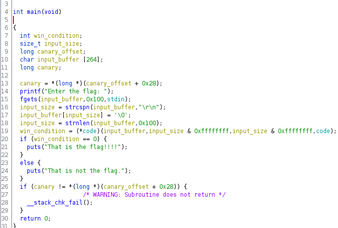
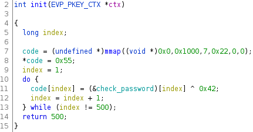
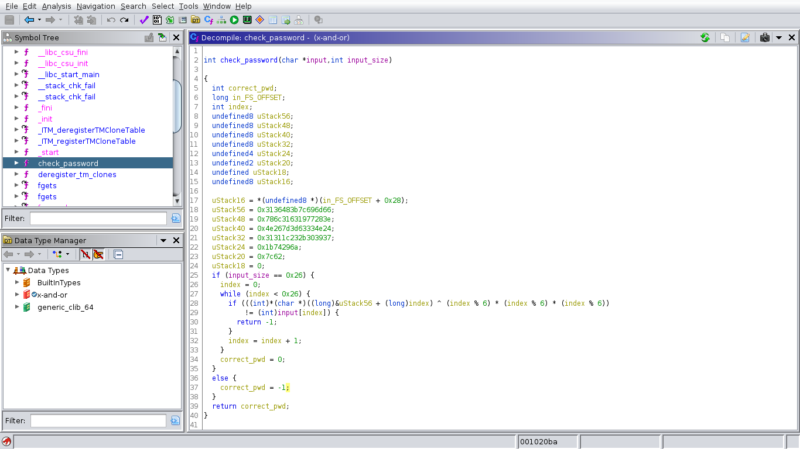

# x-and-or writeup

En esta oportunidad voy a presentar una solución al ejercicios "x-and-or" de la categoría reversing presentado en la CTF 0x41414141.

## Enunciado

En este caso no hubo ningún enunciado en especial sino que se presentó directamente el archivo binario y se espera encontrar el flag dentro de este.

## Descubriendo el tipo de archivo

Debemos ver con qué tipo de archivo vamos a trabajar, para esto simplemente podemos ejecutar el comando `file` y poder ver el resultado.

```
$ file x-and-or
$ x-and-or: ELF 64-bit LSB shared object, x86-64, version 1 (SYSV), dynamically linked, interpreter /lib64/ld-linux-x86-64.so.2, BuildID[sha1]=d75c2db
8d7b1c77fd65762741f73b19aba4f2815, for GNU/Linux 3.2.0, not stripped
```

Acá podemos ver información muy valioza. Podemos ver que es un archivo ejecutable de 64 bits para Linux. Podemos ver que está dinámicamente linkeado y que no le quitaron los símbolos de debug (ya que dice "not stripped"), lo que nos va a facilitar tanto el análisis estático y el dinámico.

## Análisis estático

Una vez que entendimos qué tipo de archivo es, vamos a cargarlo en Ghidra y ver de qué se trata. Luego de renombrar las variables (reconociendo algunos patrones):



Podemos ver entonces que el binario espera que el usuario ingrese un texto por stdin y luego aplica una función para ver si pasa el checkeo o no.

Sin embargo, podemos ver que la llamada a la función que hace el checkeo se realiza haciendo una desreferencia a un valor llamado "code". Este valor debe ser un puntero a una función, por lo que queda encontrar dónde está la implementación de dicha función.

Luego de revisar todas las funciones del binario (según su tabla de símbolos), no pude encontrar en ningún lugar la implementación de esta función a la que apuntara, por lo que decidí ejecutar el programa con gdb y pude ver que el programa efectivamente tenía una implementación de checkeo de contraseña por lo que la función si existía. Pero, dónde está?

## Segundo Análisis

Volvemos a ghidra pero ahora sabiendo que hay una función oculta en algún lado.

Buscando en todas los lugares en donde se referencia al puntero "code", pude encontrar la siguiente función (con variables renombradas):



Ahora si!

Podemos ver que se utiliza la función mmap para crear un espacio de memoria y luego se itera sobre el "array de bytes" check_password, haciendo previamente un xor. Tomémonos un momento para analizar esto:

1. Se definió en espacio de memoria constante un array de bytes fijos.
2. Al arrancar el programa, se crea el espacio de memoria necesario y se asigna al puntero code como puntero a este espacio dinámico.
3. Se cargan los bytes fijos al espacio dinámico haciendo previamente xor contra ellos.

Osea, está creando una función dinámicamente. El hecho de que haga xor es una forma de obfuscar el código para que evitemos verlo, en nuestro primer análisis, "check_password" no figuró como una función porque son bytes sin sentido.

De hecho, si hacemos el xor con los primeros 4 bytes podemos ver

```
    \x17 \x0a \xcb \xa7
xor \x42 \x42 \x42 \x42
-------------------
    \x55 \x48 \x89 \xe5
```

Que podemos interpretar como:

| código         | instrucción  |
| -------------- | ------------ |
| \x55           | push ebp     |
| \x48 \x89 \xe5 | mov ebp, esp |

Que son las primeras 2 instrucciones que se ejecutan al realizar una llamada a función. Acá está la función que buscábamos!

## Juntando todo

Ahora que sabemos cómo funciona, podemos extraer esos bytes del binario utilizando la herramienta "dd" y luego con python aplicar el xor con cada byte para tener el código assembler original. Mi idea era reemplazar el código del binario con el código desencriptado, así ghidra podría reconstruir en C la función, lo que me facilitaría bastante ver qué hace.

El programa de python que utilicé fue el siguiente:

```python
from pwn import xor
recovered = []
file = open('bytecodes', 'rb')
output_file = open('decrypt_bytecodes', 'wb+')
byte = file.read(1)
while byte:
    output_file.write(xor(byte, 0x42))
    recovered.append(hex(int.from_bytes(xor(byte, 0x42), "big")))
    byte = file.read(1)
print(recovered)
```

De esta forma podemos mandar a un archivo los bytes y tener la representación en ASCII de estos (útil más tarde).

## Patcheando el binario

"Binary Patching" es una técnica en la que se modifica un binario. Lo único que se puede hacer es reemplazar bytes, no se pueden ni agregar ni quitar.

En este caso, quería reemplazar los bytes encriptados por los bytes originales, esperando que, de esta forma, ghidra reconozca que esto no es un espacio de memoria "común" sino que es un función y que ofreza el código de la misma.

Esto fue uno de los pasos que más tiempo me llevó, hubieron problemas para pasar automáticamente los bytes así que no pude hacerlo de un solo comando. (Más tarde, discutiendo distintas soluciones con los demás competidores, me enteré que esto mismo se puede hacer directamente desde ghidra utilizando scripts).

Luego de reemplazar los bytes y de volver a analizar el binario en ghidra (así vuelve a escanear el archivo y reconoce a esta nueva función), podemos ver que funciona! Podemos reconstruir en C la función que checkea que el input sea la contraseña.

## Analizando la función de contraseña



Lamentablemente no pude hacer muchos cambios porque se ve que cuando hice el patch, me pasé de la función y dañé otros sectores del binario por lo que este archivo ya no puede correr (por suerte siempre hago un backup de los binarios antes de jugar con ellos en ghidra). Sin embargo, cumplimos el objetivo de poder reconstruir en C la función oculta.

Como se puede ver, lo primero a chequear es que el input del usuario sea de 38 caracteres (0x26 == 38). Luego, se itera por cada caracter realizando un par de cuentas con esos valores "uStackXX". Ese nombre es uno de los default de ghidra que en este caso representa que son variables locales de la función.

Lo más importante a ver es que se espera que la contraseña matchee caracter a carater. En base a esto y al hecho de que no quería decodificar el flag en base a la función, se me ocurrió volver a evaluar la función en gdb.

## Volviendo a gdb

Ahora la idea es simple, poner un caracter de 38 bytes que podemos generar con `python -c 'print(A) * 38'` para que entre en el loop y seguir al loop en cada iteración para descubrir cual es el valor esperado de cada letra.

Para esto, nos puede ser muy útil saber 2 cosas de gdb:

- Se pueden alterar los valores de los registros
- Se pueden definir funciones dentro de gdb

De esta forma, cuando el ciclo haga "cmp \<tu caracter\> vs \<caracter del flag\>", podemos imprimir la letra esperada y setearsela al registro correspondiente para que siga dentro del loop.

Eso lo podemos hacer de la siguiente manera:

```
define flag_char:
    print $edx
    set $eax = $edx
    c
end
```

Definiendo previamente un breakpoint en la función que checkea el caracter, esta función lo que hace es imprimir el valor del registro edx (donde estaba el valor esperado del caracter), setearselo a eax (donde estaba el caracter de mi input) y luego continuar la ejecución (ir hacia el otro checkeo de caracter).

De esta manera, al llamar esta función iterativamente, va a ir imprimiendo el valor esperado del flag.

`flag{560637dc0dcd33b5ff37880ca10b24fb}`

## Notas finales

Entonces, pudimos haber hecho todo desde gdb? Si. Pero se necesitó de la reconstrucción a C para entender que lo que se hacía era una comparación caracter a caracter y no algo como un hash.

Personalmente prefiero el análisis estático y esto me pareció una excusa también para jugar con ghidra y probar la idea de utilizarlo para reconstruir código de C en base a bytecode suelto.

Una mención no menor es para la herramienta online [onlinedisassembler](https://onlinedisassembler.com/odaweb/) que permite reconstruir las instrucciones de assembler dado los bytecodes.

A fin de cuentas fue un ejercicio divertido en el que pude ver implementado el hecho de crear una función dinámicamente, una idea que siempre me llamaba la atención.
