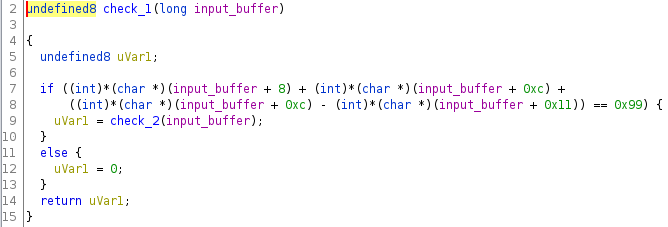

# babymix

## Análisis Inicial

Esta vez tenemos un archivo binario de C en 64 bits. Linkeado dinámicamente y todavía con los símbolos de depuración.

```
$ file babymix
$ babymix: ELF 64-bit LSB shared object, x86-64, version 1 (SYSV), dynamically linked, interpreter /lib64/ld-linux-x86-64.so.2, BuildID[sha1]=c7fdc6b7ac4f0465758600fa9062e8f07b1a47b9, for GNU/Linux 3.2.0, not stripped
```

Analizando el binario en Ghidra podemos ver que el programa simplemente lee input del usuario y checkea si es la contraseña.


Pero si vamos a analizar la función de checkeo nos encontramos con una sorpresa



Podemos ver que la función que nombré `check_1` llama a otra función que nombré `check_2`. Esto se repite 27 veces.

## Funciones de checkeo

Si nos ponemos a ver detenidamente la función de checkeo, podemos notar 2 cosas:

1. Solo se llama a la función `check_2` si se cumple la condición de `check_1`, con esto podemos inferir que para tener la contraseña tenemos que cumplir todas las condiciones `check_1 AND check_2 AND .. check_22`.
2. Las funciones de checkeo implican una restricción sobre el input, una ecuación que se tiene que cumplir.

Mi primer instinto fue interpretar estas ecuaciones como un sistema de ecuaciones lineales, sea A la matriz de ecuaciones y b el vector de resultados, tendríamos que encontar el otro vector s tal que A \* s = b. Esto se puede hacer relativamente fácil utilizando herramientas online.

Sin embargo, algunas de las funciones tenían tanto sumas como operaciones XOR sobre las mismas variables. Debido a esto, no pude utilizar la idea que tenía antes en mente y no pude resolver el ejercicio. Una vez terminado el evento, consulté con gente que si pudo resolverlo y me enteré de que utilizaron un SAT Solver.

Por qué? Tal vez por la propiedad de que `sum(a, b) = xor(a, b) + 2 * and(a, b)`, se puedan reemplazar las sumas de las ecuaciones y que queden todas en función de operaciones XOR y AND, de esta forma, armar una especie de circuito lógico y preguntar qué variación en los inputs satisface este sistema.

## Preparando las ecuaciones

Actualmente las condiciones tienen la siguiente pinta:

```C
(int)*(char *)(input + 8) + (int)*(char *)(input + 0xc) + ((int)*(char *)(input + 0xc) - (int)*(char *)(input + 0x11)) == 0x99
```

Que podríamos reescribir como:

`input[8] + input[0xc] + input[0xc] - input[0x11] = 0x99`

De esta forma podemos ver explícitamente que las ecuaciones utilizan las posiciones del array de input. Para esto podemos ir copiando todas las funciones en el programa nvim y luego usar alguna macro y regex para remover todo lo que no queremos.

Si copiamos directamente todas las funciones nos queda algo como esto:

```
(param_1 + 8) + (param_1 + 0xc) + ((param_1 + 0xc) - (param_1 + 0x11)) == 0x99
(*(byte *)(param_1 + 2) ^ *(byte *)(param_1 + 0x13)) + (int)*(char *)(param_1 + 0x15) + (int)*(char *)(param_1 + 10) == 0xd9
(param_1[0x10] ^ *param_1) + (int)(char)param_1[3] + (int)(char)param_1[0x10] + (int)(char)(param_1[0x10] ^ param_1[5]) == 0xe8)
(*param_1 ^ param_1[0x13]) + (int)(char)param_1[10] + (int)(char)param_1[3] + ((int)(char)param_1[3] - (int)(char)param_1[0x13]) == 0x148
(int)*(char *)(param_1 + 2) - (int)*(char *)(param_1 + 0x13)) + ((int)*(char *)(param_1 + 10) - (int)*(char *)(param_1 + 8)) == 0x4a
(int)*(char *)(param_1 + 0x11) - (int)*(char *)(param_1 + 9)) + (int)*(char *)(param_1 + 4) + (int)*(char *)(param_1 + 0xb) + ((int)*(char *)(param_1 + 0x11) - (int)*(char *)(param_1 + 1)) == 0xa6
...
```

Las regex útiles fueron:

- `%s/param_1 + \([0-9xa-f]*\)/param_1[\1]/g` Para convertir de param_1 + 2 a param_1[2]
- `s/(\(x\[[0-9xa-f]*\]\))/\1/g` Para convertir (x[0x11]) en x[0x11]
- `s/0x[0-9a-f]*/\=printf('%d', submatch(0))/g` Para convertir de hexa a decimal

Entonces el sistema nos puede quedar así:

```
x[8] + x[12] + (x[12] - x[17]) == 153
(x[2] ^ x[19]) + x[21] + x[10] == 217
(x[16] ^ x[0]) + x[3] +  x[16] + (x[16] ^ x[5]) == 232
(x[0] ^ x[19]) + x[10] + x[3] +  (x[3] - x[19]) == 328
(x[2] - x[19]) + (x[10] - x[8]) == 74
(x[17] - x[9]) + x[4] + x[11] + (x[17] - x[1]) == 166
x[10] + x[5] + (x[18] - x[9]) + x[10] + x[14] == 413
x[21] + x[1] + (x[11] - x[2]) + (x[17] - x[13]) + (x[8] - x[12]) + (x[5] - x[16]) == 98
(x[12] ^ x[16]) + (x[6] - x[13]) + (x[17] - x[11]) + (x[13] ^ x[19]) == 85
(x[7] ^ x[2]) + (x[4] - x[16]) == 77
x[10] + x[7] + (x[14] ^ x[8]) + x[1] + x[5] + (x[14] - x[3]) + (x[8] - x[17]) == 384
x[2] + x[17] + (x[15] - x[21]) + (x[2] - x[4]) + (x[4] - x[0]) == 265
x[6] + x[7] + (x[21] - x[18]) + x[2] + x[15] + (x[17] - x[4]) + (x[5] - x[18]) == 250
(x[18] ^ x[12]) + (x[7] - x[18]) + (x[21] - x[19]) + (x[16] - x[21]) == 75
x[6] + x[9] + (x[2] ^ x[10]) + x[7] + x[2] + x[13] + x[20] + (x[16] ^ x[3]) == 621
(x[1] - x[19]) + (x[2] ^ x[14]) + x[0] + x[11] + (x[8] - x[3]) == 283
(x[13] - x[19]) + (x[11] ^ x[0]) + (x[14] ^ x[0]) + (x[16] - x[14]) == 106
(x[3] - x[18]) + (x[0] - x[20]) + x[19] + x[10] + x[10] + x[19] == 297
x[18] + x[20] + (x[0] - x[15]) == 156
(x[3] - x[17]) + (x[10] - x[20]) + (x[13] - x[8]) == 85
(x[10] - x[2]) + x[4] + x[19] + (x[17] ^ x[12]) + (x[3] - x[17]) == 160
(x[12] - x[10]) + (x[11] - x[21]) == 36
(x[16] ^ x[5]) + (x[6] - x[16]) + (x[19] ^ x[18]) == 102
(x[21] - x[5]) + (x[6] - x[13]) + (x[15] ^ x[10]) == -48
(x[4] ^ x[6]) + (x[12] - x[11]) + (x[3] ^ x[5]) == 29
(x[21] - x[11]) + (x[8] - x[15]) + (x[9] - x[2]) + (x[6] - x[14]) == -109
x[17] + x[11] + x[0] + x[16] + (x[19] - x[7]) == 361
(x[19] ^ x[15]) + x[15] + x[3] == 296
```

Fijense que como el número de variable más alto es 21 (x[21]), esto significa que el sistema de ecuaciones utiliza 22 posiciones y por lo tanto el flag es de 22 caracteres.

## Exploit

Teniendo las ecuaciones, podríamos armar un script como el siguiente:

```python
from z3

solver = z3.Solver()

x = [z3.BitVec(f"x[{i}]", 8) for i in range(22)]

for v in x:
    system.add( v >= 0 )

solver.add(ecuacion_1)
solver.add(ecuacion_2)
#...

if system.check():
    print('dice{' + '' . join([chr(system.model()[password[i]].as_long()) for i in range(len(password))]) + '}')
else:
    print('not solution')
```

El script lo hice en base a las soluciones que fueron publicando otros grupos. Si bien estuve muy cerca de resolverlo, a veces nos falta conocer una herramienta (o un feature de una herramienta) y estos ejercicios nos sirven también para eso. Es importante volver a lo que no supimos hacer o no nos salió para aprender.
